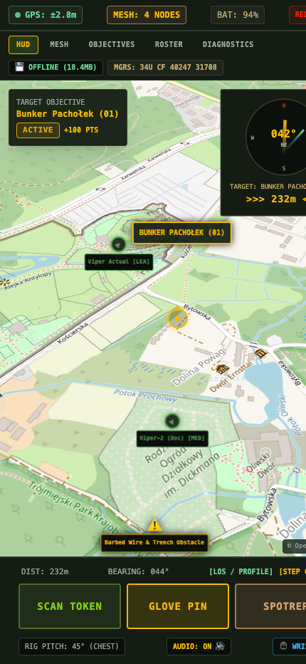
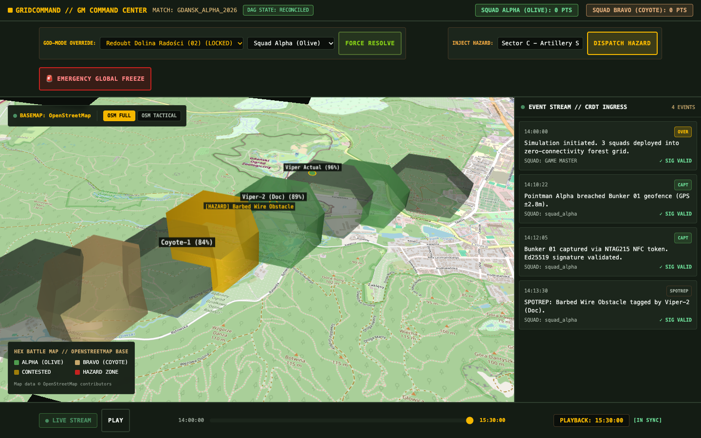
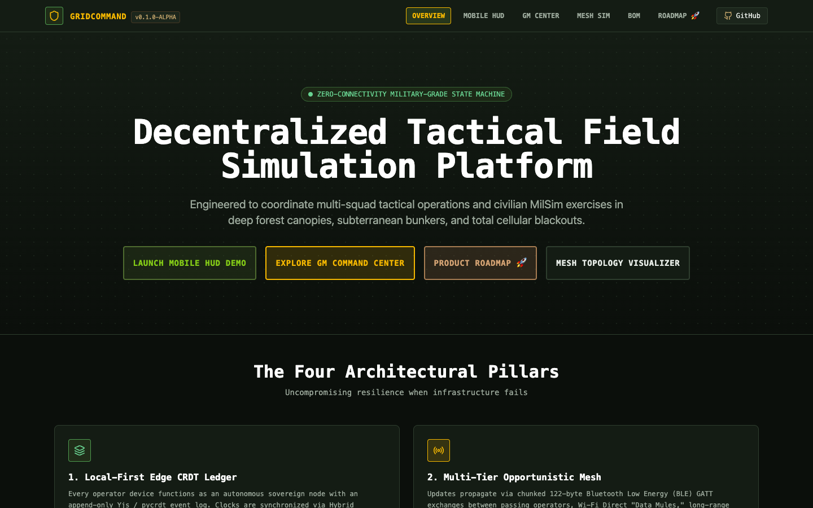

# GridCommand ⚡

[](https://github.com/FranekJemiolo/gridcommand/actions/workflows/ci.yml)
[](https://franekjemiolo.github.io/gridcommand/)
[](LICENSE)
[](https://turbo.build/)
[](https://pnpm.io/)
[](https://github.com/astral-sh/uv)

> 🌐 **Live Documentation & Interactive Demo Platform:** [https://franekjemiolo.github.io/gridcommand/](https://franekjemiolo.github.io/gridcommand/)

**GridCommand** is a decentralized, local-first tactical field simulation and command-and-control (C2) platform engineered to coordinate multi-squad tactical simulations, civilian MilSim events, scouting expeditions, and outdoor navigation exercises in strict zero-connectivity environments (dense forests, deep valleys, wetlands, and subterranean structures).

GridCommand treats physical battlespace terrain as an automated, cryptographically verified state machine with no cloud or cellular dependencies.

---

## 📸 Screenshots & Visual Interface

### 1. Mobile Tactical Field Client — Rig Mode HUD
*Custom 45° pitched map perspective for MOLLE chest rigs, MapLibre GL offline PMTiles vector engine, glanceable compass bearing dial, breach alerts, and 60x60px glove-friendly touch targets.*



---

### 2. Game Master Command Center & Temporal Scrubber
*Deck.gl 3D discretized hex battle map, God-mode administrative overrides, dynamic hazard injections with countdown evacuation timers, and temporal DVR scrubber allowing historical replay.*



---

### 3. Documentation & Interactive Demonstration Platform
*Interactive architecture showcase explaining CRDT event sourcing, multi-hop BLE/LoRa data propagation, and hardware bill of materials.*



---

## 🏛️ Core Architectural Foundations

1. **Local-First Edge Architecture**: Every player device operates as an autonomous, self-sovereign edge node with an immutable, append-only Event Sourcing ledger backed by Conflict-free Replicated Data Types (CRDTs). The platform functions indefinitely with zero internet access.
2. **Multi-Tier Opportunistic Mesh Propagation**: Telemetry and state updates propagate organically across the physical battlespace via Bluetooth Low Energy (BLE) chunked gossip protocols (122-byte MTU boundaries), Wi-Fi Direct opportunistic "Data Mules," long-range Meshtastic LoRa radio bridges (2–5 km canopy range), and physical USB-C On-The-Go (OTG) sneakernet fallbacks.
3. **Cryptographic Proof of Physical Presence**: Eliminates GPS drift and spoofing exploits by authenticating physical objectives through dual-encoded NFC chips (NTAG215) and high-contrast Base45 QR codes signed with Game Master (GM) Ed25519 private keys and validated against sensor-fusion snapshots (accelerometer & gyro motion verification).
4. **Deterministic Client-Side DAG State Machine**: Missions are modeled as Directed Acyclic Graphs (DAGs). Every device independently folds the chronologically sorted Hybrid Logical Clock (HLC) event ledger over the mission graph, guaranteeing identical state convergence and automatic time-travel rollbacks without a central authority.

---

## 📦 Repository Structure

```
gridcommand/
├── .github/
│   └── workflows/
│       ├── ci.yml                     # Full CI test matrix (pnpm + uv)
│       └── deploy-pages.yml           # Automated GitHub Pages deployment
├── apps/
│   ├── mobile/                        # Capacitor + Vite + React 18 Mobile Field Client
│   │   ├── capacitor.config.ts        # Native iOS / Android wrapper configuration
│   │   └── src/                       # Rig Mode HUD, MapLibre GL + PMTiles, Glove PIN modal
│   ├── gm-dashboard/                  # GM Web Command Center (Deck.gl 3D hexes + DVR Scrubber)
│   └── docs/                          # Interactive Documentation & Live Demo site
├── packages/
│   ├── crdt-core/                     # Shared TypeScript Yjs ledger schemas, HLC & DAG reducer
│   ├── crypto/                        # Ed25519 signing/verification & RFC 9285 Base45 codecs
│   └── ui-theme/                      # Military-grade tokens, Tactical Red-Light filter, 60px buttons
├── services/
│   ├── backend-ingress/               # FastAPI + pycrdt + Redis mesh ingestion (managed with uv)
│   └── dag-rule-engine/               # NetworkX DAG graph evaluator & anti-cheat heuristics (uv)
├── docs/                              # Vision, implementation plan, journal, and screenshots
│   ├── vision.md                      # Complete system specification
│   ├── implementation_plan.md         # Engineering implementation plan
│   └── JOURNAL.md                     # Engineering changelog and milestones
├── package.json                       # pnpm root workspace definition
└── turbo.json                         # Turborepo task pipeline
```

---

## 🛠️ Technology Stack

| Domain | Technology | Field Rationale |
| :--- | :--- | :--- |
| **Monorepo** | `pnpm` workspaces + `Turborepo` | Ultra-fast caching, deterministic dependency resolution. |
| **Frontend Apps** | React 18, TypeScript, Vite, TailwindCSS | High-performance edge UI, sub-second hot reloading. |
| **Mobile Native** | Ionic Capacitor | Cross-platform Android/iOS native container with hardware sensors. |
| **Mapping Engine** | MapLibre GL + `pmtiles` | Serverless, single-file offline vector tile container. |
| **Data Visualization**| Deck.gl (3D Hexagon ColumnLayer) | GPU-accelerated macro battlefield tactical discretization. |
| **CRDT State Engine** | `yjs` (TypeScript) & `pycrdt` (Python) | Append-only conflict-free event sourcing. |
| **Causality & Clocks**| Hybrid Logical Clocks (HLC) | Physical millisecond correspondence + deterministic Lamport ordering. |
| **Cryptography** | `@noble/curves` (Ed25519) + Base45 | Sub-millisecond offline token verification & compact QR payloads. |
| **Python Tooling** | Astral `uv` | Instantaneous Python virtual environments and package management. |
| **Python Services** | FastAPI, NetworkX, Redis | High-throughput binary ingestion and DAG rule cascade validation. |
| **Testing** | Vitest (TS) & Pytest (Python) | Comprehensive unit, cryptographic, and causal invariant tests. |

---

## 🚀 Quickstart & Local Development

### Prerequisites
- **Node.js**: v20+
- **pnpm**: v9+ (`npm install -g pnpm` or `brew install pnpm`)
- **uv**: Latest (`brew install uv` or `curl -LsSf https://astral.sh/uv/install.sh | sh`)

### 1. Installation
Clone the repository and install all frontend and shared dependencies:
```bash
git clone git@github.com:FranekJemiolo/gridcommand.git
cd gridcommand
pnpm install
```

### 2. Build and Test Everything
Run TypeScript package builds, linting, and unit tests:
```bash
# Build all packages and apps
pnpm build

# Run unit tests across packages
pnpm test

# Run TypeScript typechecks
pnpm lint
```

### 3. Run Python Microservices (with `uv`)
Test backend services using Astral's `uv`:
```bash
# Run backend ingress tests
cd services/backend-ingress
uv run pytest

# Run DAG rule engine tests
cd ../dag-rule-engine
uv run pytest
```

### 4. Run Development Servers
Launch all applications concurrently via Turborepo:
```bash
pnpm dev
```
Or run individual applications:
- **Docs & Demo Site**: `pnpm --filter "@gridcommand/docs" dev` (http://localhost:5175)
- **Mobile Field Client**: `pnpm --filter "@gridcommand/mobile" dev` (http://localhost:5173)
- **Game Master Dashboard**: `pnpm --filter "@gridcommand/gm-dashboard" dev` (http://localhost:5174)

---

## 🌐 Live Interactive Demonstration

Explore the live interactive architecture and Game Master DVR console hosted on GitHub Pages:
**[https://franekjemiolo.github.io/gridcommand/](https://franekjemiolo.github.io/gridcommand/)**

---

## 🚀 Version 2.0 Tactical Architecture

GridCommand v2.0 introduces next-generation tactical field extensions for both Game Masters and operators:
- **Defense Interoperability (ATAK CoT)**: Bidirectional Cursor-on-Target XML gateway for ATAK/WinTAK/CivTAK and QGIS.
- **Dynamic Weather & EW Jamming**: Meteorological rain, smoke screens with wind drift, thermal fog, and RF jamming bubbles.
- **Autonomous AI OPFOR Bots**: Red-team adversary agents executing tactical waypoint patrols and procedural DAG mission authoring.
- **AR Spatial Camera Overlay HUD**: Direct camera viewfinder overlay with virtual 3D floating markers and compass azimuth ladder.
- **Tactical Acoustic Intercom (PTT)**: Mesh-packetized voice bursts and tactical quick-shouts.
- **Automated Field Edge Installer**: One-line field setup script (`./deploy/install.sh`) and hardened production Docker stack (`deploy/docker-compose.prod.yml`).

See the complete [Version 2.0 Vision Specification](docs/V2_VISION.md).

---

## 🚢 Production Deployment & Field Hardware Setup

Complete end-to-end production deployment instructions are documented in [docs/deployment.md](docs/deployment.md) and [docs/V2_VISION.md](docs/V2_VISION.md), covering:

1. **One-Command Automated Installer**: `./deploy/install.sh` builds and configures Node.js, pnpm, Astral uv, and all microservices on Ubuntu, Debian, macOS, or Raspberry Pi.
2. **Production Docker Compose Stack**: `docker compose -f deploy/docker-compose.prod.yml up -d` launches Redis, FastAPI Ingress, and Nginx.
3. **Field PWA Offline Installation**: Installing the Tactical Field Client directly onto Android/iOS devices without internet or app stores.
4. **Standalone Android APK Generation**: Compiling and signing native release APKs via Capacitor (`pnpm cap:android` / `npx cap sync android`).
5. **GL.iNet Tactical Router Setup**: Autonomous offline Wi-Fi bubble with DNS hijacking (`address=/#/192.168.8.1`) and mDNS discovery (`basecamp.local`).
6. **Air-Gapped Sneakernet Disaster Recovery**: Physical USB-OTG/MicroSD state synchronization scripts (`./scripts/sneakernet-sync.sh`) during total electronic warfare / RF blackout.

---

## 📄 License

MIT © [Franek Jemiolo](https://github.com/FranekJemiolo)
