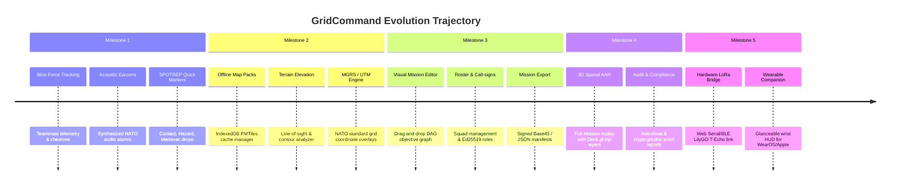

# GridCommand Product Maturity Roadmap

This document outlines the strategic engineering roadmap to transition **GridCommand** from its initial MVP scaffold into a mature, production-grade tactical simulation and decentralized field operations platform.

The roadmap is divided into five sequential milestones focused on mission realism, field reliability, operator survivability, and zero-connectivity tactical coordination.

---

## 🗺️ Milestone Overview

---

## 📍 Milestone 1: Tactical Field Comms & Situational Awareness
*Target: Immediate Implementation*
*Focus: Peer-to-peer operator visibility, audio situational cues, and decentralized battlefield reports.*

### Features
1. **Blue Force Tracking (BFT)**
   - Decentralized presence broadcast via Yjs CRDT `peers` map.
   - Live telemetry: GPS latitude/longitude, altitude, compass heading, battery percentage, active call-sign, and squad designation (Alpha Olive / Bravo Coyote).
   - Dynamic chevrons rendered on mobile MapLibre HUD showing teammate distance, bearing, and movement direction.
   - Out-of-contact decay: visual dimming for operators with HLC timestamps older than 60 seconds.

2. **NATO Standard Acoustic Earcons (Web Audio API)**
   - Synthesized military alert tones playable via bone-conduction headsets without looking down at the chest rig:
     - **Contact Alarm**: Dual-tone sharp pulses for hostile presence or contested objective.
     - **Inbound Hazard / Artillery**: Rising frequency modulation siren for zone contamination.
     - **Objective Breached / Captured**: Low-to-high confirmation chime.
     - **Emergency Global Freeze**: Distinct continuous low-frequency stutter alarm.
   - Audio master toggle with volume and vibration/haptic feedback integration.

3. **Field SPOTREP & Quick Tactical Markers**
   - 1-tap rapid report marker drops on the tactical map:
     - 🔴 **Hostile Contact**: Reported enemy sighting with auto-decay (15 min).
     - ⚠️ **Hazard / Obstacle**: Minefield, barbed wire, or impassable terrain.
     - 🚑 **Medevac / Casualty**: Operator down or casualty simulation point.
     - 📦 **Supply / Ammo Cache**: Resupply or dropped equipment point.
     - 🎯 **Rally Point / Waypoint**: Squad coordination rally marker.
   - Stored in CRDT `markers` collection with cryptographic author signature and automatic distributed convergence.

---

## 🗺️ Milestone 2: Offline Map Packs & Terrain Elevation Profile
*Focus: Full offline autonomy in deep wilderness and topographical analysis.*

### Features
1. **Offline Map Pack Storage Manager**
   - Client-side IndexedDB & Cache API tile cache manager.
   - Pre-download operational sectors (e.g., 5km × 5km or 20km × 20km areas) at zoom levels 10–16.
   - Storage quota inspection, single-click sector purging, and offline verification status.
2. **Line-of-Sight (LOS) & Elevation Profile Calculator**
   - Digital Elevation Model (DEM) raster/vector terrain contour parsing.
   - Real-time line-of-sight raycasting between operator GPS position and target objectives.
   - Indicates ridge blockages, dead ground, and altitude delta (+/- meters elevation).
3. **MGRS (Military Grid Reference System) Engine**
   - Real-time conversion between WGS84 (Lat/Lng) and MGRS 10-figure grid coordinates (e.g., `34U DA 12345 67890`).
   - MGRS coordinate HUD HUD toggle for military radio voice communication.

---

## 🛠️ Milestone 3: Dynamic Mission Builder & Graph Editor
*Focus: Zero-code mission authoring and role-based operational command.*

### Features
1. **Visual DAG Mission Builder (GM Dashboard)**
   - Interactive map-based objective placement with configurable geofence radii (10m–500m).
   - Visual dependency graph editor: link Objective A → Objective B with drag-and-drop connectors (requiring Objective A capture before Objective B unlocks).
   - Configurable capture mechanics: Instant NFC tap, timed hold (e.g. hold zone for 180s), or multi-point synchronized capture.
2. **Squad Roster & Call-Sign Management**
   - Assign field operators to squads, configure radio call-signs, and designate operational roles (Squad Leader, Pointman, Medic, Radio Operator, Marksman).
   - Key management console: Register and revoke operator Ed25519 public keys.
3. **Signed Mission Manifest Export / Import**
   - Export entire mission specifications as cryptographically signed JSON/CBOR packages.
   - Air-gapped loading via Base45 high-density QR code scanning or USB OTG flash drive.

---

## 📊 Milestone 4: After-Action Review (AAR) & Cryptographic Audit
*Focus: Post-mission tactical debrief, operational analytics, and anti-cheat validation.*

### Features
1. **3D Spatial AAR Playback Engine**
   - Deck.gl TripsLayer spatial timeline replay showing full squad maneuvers, skirmishes, and capture events.
   - Playback speed control (1x, 5x, 20x) with event bookmarks and casualty logs.
   - Territory control heatmap showing contested hex dynamics over mission duration.
2. **Cryptographic Proof & Anti-Cheat Audit**
   - Automated validation of all signed CRDT event logs against physical sensor bounds.
   - Flag impossible operator travel speeds (teleportation/vehicle exploits), invalid token signatures, and out-of-order HLC anomalies.
   - PDF & JSON audit report generation suitable for formal competition or defense evaluations.

---

## 📡 Milestone 5: Hardware Integration & Native Wearable Ecosystem
*Focus: Sub-GHz canopy penetration and hands-free wearable sub-displays.*

### Features
1. **LoRa / Meshtastic Web Serial & Web Bluetooth Bridge**
   - Direct browser connection to LilyGO T-Echo / T-Beam SX1262 transceivers via Web Serial API and Web Bluetooth.
   - Transparent fragmentation of Base45 CRDT delta packets into 237-byte LoRa payloads.
   - Range extension to 2–5km through dense wet pine forest canopies where 2.4GHz BLE fails.
2. **Wearable Sub-HUD (WearOS / Apple Watch / Garmin Companion)**
   - Lightweight companion glanceable display on operator's wrist.
   - Target bearing arrow, distance counter, objective state, and 1-tap glove PIN confirmation.
3. **Sensor-Fusion Rig Calibration**
   - Magnetometer auto-calibration routine with tilt-compensated digital compass algorithm.

---

## 🚀 Execution Strategy

Milestones are prioritized sequentially:
1. **Milestone 1**: `✓ COMPLETED & VERIFIED` (Blue Force Tracking, Acoustic Earcons, SPOTREP quick markers).
2. **Milestone 2**: `✓ COMPLETED & VERIFIED` (Offline map storage manager, line-of-sight & terrain elevation profile analyzer, NATO 10-figure MGRS engine).
3. **Milestone 3**: `✓ COMPLETED & VERIFIED` (Dynamic DAG mission graph builder, squad roster & keypair registry, signed Base45/JSON manifests).
4. **Milestone 4**: `✓ COMPLETED & VERIFIED` (3D spatial AAR playback, timeline scrubber, event bookmarks, territory score dynamics, and physical/cryptographic anti-cheat audit engine).
5. **Milestone 5**: `✓ COMPLETED & VERIFIED` (Sub-GHz LoRa SX1262 transceiver bridge, 237-byte MTU chunking with CCITT CRC16, wearable wrist companion HUD, and sensor-fusion tilt-compensated compass calibration).

> **Production Readiness Status**: All 5 Milestones are fully implemented, verified with comprehensive unit & E2E integration test suites, and validated visually across the mobile client, GM command center, and live documentation laboratory.
