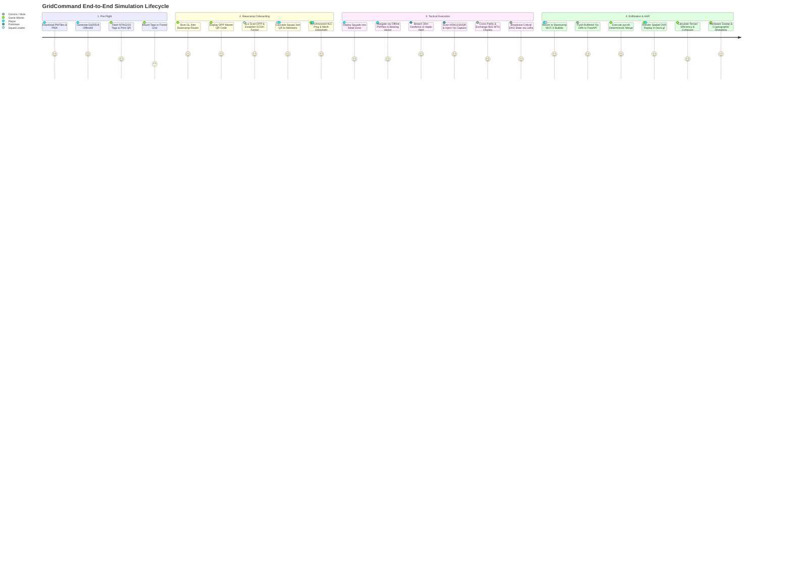
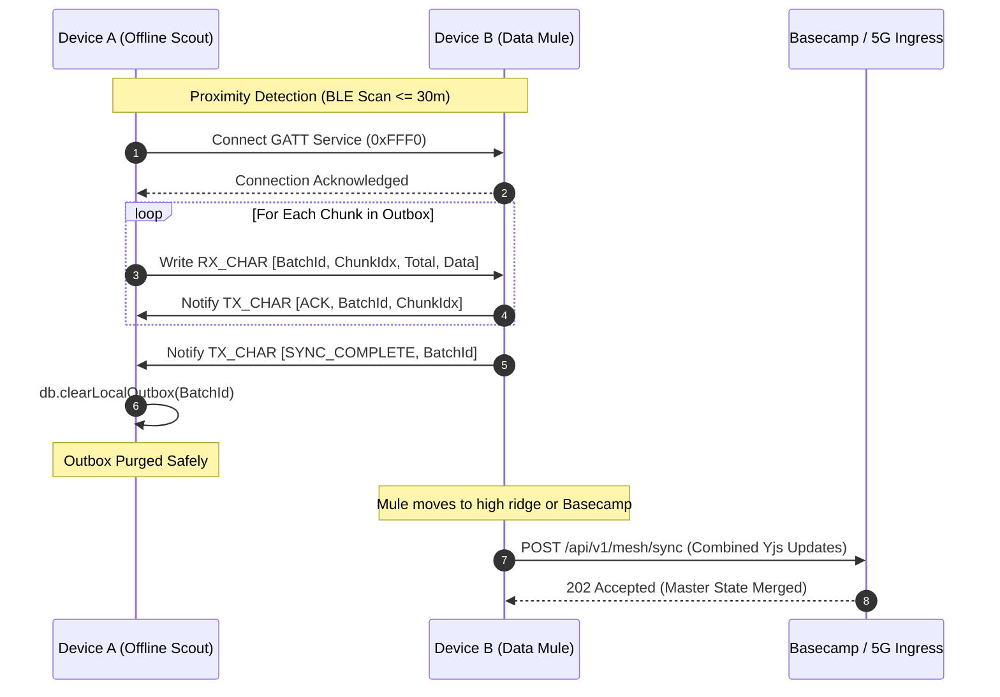
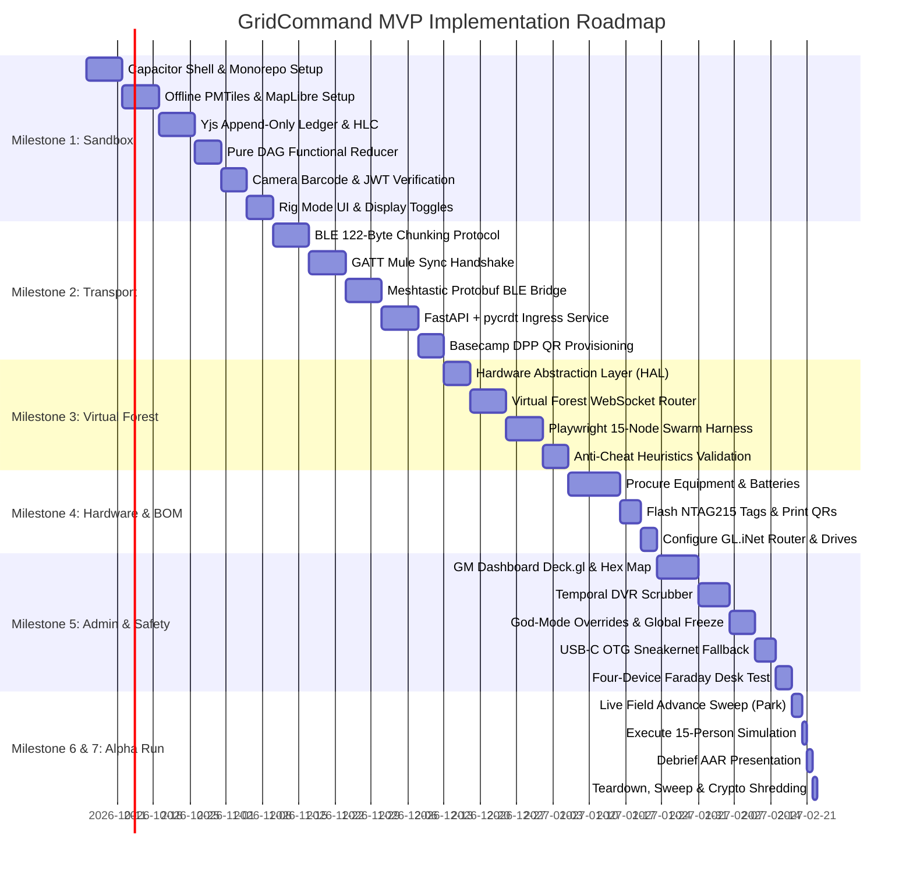

# GridCommand: System Vision, Technical Architecture & MVP Implementation Blueprint

---

## 1. Executive Summary & Vision Statement

### 1.1 The Operational Problem
Traditional outdoor field simulations—whether youth scouting expeditions, civilian military simulation (MilSim) events, airsoft tactical skirmishes, or professional defense navigation training—suffer from a fundamental technological paradox: modern command-and-control (C2) software assumes constant high-bandwidth cloud connectivity, while real-world tactical terrain (dense pine forests, deep valleys, wetlands, and subterranean structures) is characterized by severe cellular attenuation, multipath GPS drift, and complete network blackout.

In these environments, organizers are forced to fall back on fragile analog solutions: paper maps that degrade in the rain, analog FM walkie-talkies that suffer from channel saturation and lack spatial context, and honor-system objective scoring that leads to unresolved gameplay disputes. Conversely, existing mobile civilian apps either require constant 4G/5G connections (causing battery death and frozen interfaces) or act as passive GPS loggers incapable of real-time multi-unit coordination, dynamic hazard injection, or anti-cheat validation.

### 1.2 The GridCommand Paradigm
**GridCommand** is a decentralized, local-first tactical C2 and MilSim operations platform engineered specifically to execute multi-squad simulations in strict zero-connectivity environments. 

GridCommand treats the physical terrain as an automated, cryptographically verified state machine. The platform operates on four foundational pillars:
1. **Local-First Edge Architecture**: Every player device functions as an autonomous, self-sovereign edge node hosting an immutable, append-only Event Sourcing ledger backed by Conflict-free Replicated Data Types (CRDTs). The system functions indefinitely with zero internet access.
2. **Multi-Tier Opportunistic Mesh Propagation**: Telemetry and state updates propagate organically across the physical battlespace via Bluetooth Low Energy (BLE) chunked gossip protocols, Wi-Fi Direct opportunistic "Data Mules," long-range Meshtastic LoRa radio bridges, and physical USB-C On-The-Go (OTG) sneakernet fallbacks.
3. **Cryptographic Proof of Physical Presence**: Eliminating GPS drift and spoofer exploits, physical objectives are authenticated via dual-encoded NFC chips (NTAG215) and high-contrast, low-density QR codes signed with Game Master (GM) Ed25519 private keys and validated against local sensor fusion (accelerometer/gyroscope) snapshots.
4. **Deterministic Client-Side DAG State Machine**: Missions are modeled as Directed Acyclic Graphs (DAGs). The game state is not synchronized as mutable records; rather, every device independently folds the chronologically sorted Hybrid Logical Clock (HLC) event ledger over the mission graph, guaranteeing identical state convergence and automatic time-travel rollbacks without a central authority.

```
+-----------------------------------------------------------------------------------+
|                           GRIDCOMMAND ARCHITECTURAL SPECTRUM                      |
+-----------------------------------------------------------------------------------+
|  PHYSICAL TERRAIN      |  TACTICAL EDGE NODES        |  PROPAGATION LAYER         |
|  - NTAG215 Epoxy Discs |  - Squad Leaders (Rig HUD)  |  - BLE MTU Gossip (30m)    |
|  - Rite-in-Rain QRs    |  - Pointmen (Compass HUD)   |  - Meshtastic LoRa (2-5km) |
|  - Dense Tree Canopy   |  - Comms / Data Mules       |  - Basecamp 5V Wi-Fi 6     |
+------------------------+-----------------------------+----------------------------+
                                       |
                                       v
+-----------------------------------------------------------------------------------+
|  STATE SYNCHRONIZATION ENGINE                                                     |
|  - Event Sourcing via Yjs / pycrdt Append-Only Ledger                             |
|  - Hybrid Logical Clocks (HLC) Deterministic Ordering & Automatic Rollbacks       |
|  - Zero-Trust Cryptographic Signature Verification (Ed25519)                      |
+-----------------------------------------------------------------------------------+
                                       |
                                       v
+-----------------------------------------------------------------------------------+
|  OPERATIONAL COMMAND & REVIEW                                                     |
|  - Game Master Real-Time Hex Battle Map (Deck.gl / MapLibre GL)                   |
|  - Dynamic Artillery / Hazard Injects & Emergency Global Freeze                   |
|  - Spatial DVR Replay, Terrain Efficiency (TES) & Squad Cohesion Analytics        |
+-----------------------------------------------------------------------------------+
```

---

## 2. Personas & Operational Lifecycle

### 2.1 Operator Personas

| Persona | Operational Environment | Primary Hardware | Cognitive & Physical Constraints | Required Toolset |
| :--- | :--- | :--- | :--- | :--- |
| **Game Master (GM)** | Basecamp command tent or mobile vehicle; high-stress orchestration of 15–50 participants. | Rugged Tablet (iPad Pro / Galaxy Active4 Pro) running PWA/Capacitor; GL.iNet AX router; USB-C OTG flash drive. | Needs macro oversight; cannot parse individual footsteps; requires single-click hazard injection and dispute resolution. | Hex-discretized tactical map, DAG dependency viewer, Event Ticker, Hazard polygon drawer, God-Mode override console. |
| **Squad Leader (SL)** | Moving through rugged terrain; managing 4–8 operators under time pressure. | Smartphone mounted on chest rig (45° tilt) in waterproof pouch; connected to external 10,000mAh battery. | Heavy physical exertion; ambient glare/rain; tactical gloves; high cognitive load. | 3D vector map with compass bearing, squad health/comms status, dynamic DAG objective vectors, hardware volume button triggers. |
| **Pointman / Scout** | Forward reconnaissance; first to breach objectives and search physical brush. | Smartphone handheld or forearm mount; camera/NFC accessible. | Moving fast; hands frequently occupied; operating in dense brush or low light. | Heads-up glanceable compass, distance-to-target countdown, automatic camera viewfinder activation upon breach, 6-digit glove numpad. |
| **Comms / Data Mule** | Mid-formation; responsible for squad connectivity and link to basecamp. | Smartphone paired via BLE to a vest-mounted LilyGO T-Echo / Heltec V3 LoRa radio. | Must monitor radio link quality, mesh fragmentation health, and battery levels. | Radar view showing BLE neighbor proximity, LoRa packet transmit counters, manual force-sync trigger. |

### 2.2 Operational Lifecycle Phases



---

## 3. Structural Topology & System Architecture

### 3.1 Monorepo Repository Structure
The project is architected as a clean, modular TypeScript + Python monorepo using **pnpm workspaces** and **Turborepo** for frontend/edge packages, alongside a Python environment managed via **Poetry** for backend microservices and data pipelines.

```
gridcommand/
├── .github/
│   └── workflows/
│       ├── test-frontend.yml
│       ├── test-backend.yml
│       ├── playwright-swarm.yml
│       └── release-apk.yml
├── apps/
│   ├── mobile/                        # Capacitor + Vite + React 18 Mobile Field Client
│   │   ├── android/                   # Native Android wrapper project
│   │   ├── ios/                       # Native iOS wrapper project
│   │   ├── src/
│   │   │   ├── components/
│   │   │   │   ├── hud/               # Glanceable Compass, Distance Deck, Telemetry Header
│   │   │   │   ├── scanner/           # Camera Preview, Numpad Fallback, NFC Tether
│   │   │   │   ├── map/               # MapLibre GL instance, PMTiles offline vector loader
│   │   │   │   └── tactical/          # Red-Light filter wrapper, Rain Lock touch guard
│   │   │   ├── hooks/
│   │   │   │   ├── useHLC.ts          # Hybrid Logical Clock generation and ticking
│   │   │   │   ├── useGeolocation.ts  # Filtered GPS watchPosition with Kalman smoothing
│   │   │   │   ├── useBLEMesh.ts      # Chunked MTU GATT server/client protocol
│   │   │   │   └── useLoRaBridge.ts   # Meshtastic Protobuf BLE client integration
│   │   │   ├── stores/                # Zustand client state (UI state, current role)
│   │   │   ├── App.tsx
│   │   │   └── index.css              # Custom military-grade tactical styling
│   │   ├── capacitor.config.ts
│   │   └── package.json
│   ├── gm-dashboard/                  # GM Web Command Center (Deck.gl + React)
│   │   ├── src/
│   │   │   ├── components/
│   │   │   │   ├── hex-map/           # Deck.gl H3 / Hexagon tactical layer
│   │   │   │   ├── dvr/               # Temporal scrubber & event playback controls
│   │   │   │   ├── dag-inspector/     # Interactive mission dependency graph
│   │   │   │   ├── hazard-tools/      # Artillery & gas polygon drawing palette
│   │   │   │   └── admin-console/     # God-Mode Force Resolve & Global Freeze
│   │   │   ├── hooks/
│   │   │   │   └── useGMSocket.ts     # Real-time WebSocket patch consumer
│   │   │   └── App.tsx
│   │   └── package.json
│   └── virtual-forest/                # Simulation harness for headless multi-agent swarm
│       ├── src/
│       │   ├── router.ts              # Proximity-based mock BLE/LoRa packet router
│       │   ├── swarm-orchestrator.ts  # Playwright 15-node runner with GPX injection
│       │   └── index.ts
│       └── package.json
├── packages/
│   ├── crdt-core/                     # Shared TypeScript Yjs ledger schemas & pure DAG reducer
│   │   ├── src/
│   │   │   ├── ledger.ts              # Y.Map append-only event schema & accessors
│   │   │   ├── hlc.ts                 # Hybrid Logical Clock math & comparisons
│   │   │   ├── reducer.ts             # Deterministic DAG functional reducer
│   │   │   └── types.ts               # CAPT, OVER, SOS, HAZ event interfaces
│   │   └── package.json
│   ├── crypto/                        # Ed25519 signature validation & DPP helpers
│   │   ├── src/
│   │   │   ├── signer.ts              # SubtleCrypto / tweetnacl Ed25519 signing
│   │   │   ├── verifier.ts            # High-speed offline signature verification
│   │   │   └── base45.ts              # Compact Base45 encoder/decoder for QR tokens
│   │   └── package.json
│   ├── hal-simulation/                # Hardware Abstraction Layer for unit & E2E tests
│   │   ├── src/
│   │   │   ├── mock-ble.ts            # In-memory GATT peripheral/central emulation
│   │   │   ├── mock-gps.ts            # Programmable GPX waypoint emitter
│   │   │   └── mock-camera.ts         # Simulated QR barcode scanner injector
│   │   └── package.json
│   └── ui-theme/                      # Shared tactical CSS design tokens & UI components
│       ├── src/
│       │   ├── tokens.css             # HSL palettes, red-light values, typography
│       │   └── buttons/               # 60x60px glove-friendly tactile buttons
│       └── package.json
├── services/
│   ├── backend-ingress/               # FastAPI + pycrdt Cloud & Basecamp Ingress Service
│   │   ├── app/
│   │   │   ├── api/                   # /mesh/sync (application/octet-stream endpoint)
│   │   │   ├── core/                  # Security, Kafka producer, Redis bridge
│   │   │   ├── services/
│   │   │   │   ├── crdt_engine.py     # pycrdt deterministic document merge
│   │   │   │   └── kafka_producer.py  # Partitioned streaming to Kafka topics
│   │   │   └── main.py
│   │   ├── Dockerfile
│   │   └── pyproject.toml
│   ├── dag-rule-engine/               # Kafka consumer evaluating DAG cascades & anti-cheat
│   │   ├── app/
│   │   │   ├── consumers/             # Kafka consumers for game.crdt.ingress
│   │   │   ├── heuristics/            # Superman velocity & 0.00° azimuth detectors
│   │   │   ├── engine/                # Python networkx / custom DAG cascade evaluator
│   │   │   └── main.py
│   │   ├── Dockerfile
│   │   └── pyproject.toml
│   └── aar-analytics/                 # Post-game telemetry processor & metric generator
│       ├── app/
│       │   ├── algorithms/            # Terrain Efficiency (TES) & Squad Cohesion
│       │   ├── export/                # Anonymized JSON report generator & GDPR shredder
│       │   └── main.py
│       └── pyproject.toml
├── hardware/                          # Physical assets & embedded tooling
│   ├── nfc-flasher/                   # Node/Python CLI to batch write signed JWTs to NTAG215
│   ├── qr-generator/                  # Generates printable high-contrast Rite-in-Rain SVGs
│   ├── meshtastic/                    # Custom device settings & channels for LilyGO radios
│   └── bom.md                         # Complete procurement specifications
├── docker-compose.yml                 # Local dev orchestration (Kafka, Redis, Ingress)
├── package.json                       # Monorepo root package.json
└── turbo.json                         # Turborepo task pipeline definition
```

---

## 4. Deep Feature Technical Specifications

### 4.1 Hybrid Logical Clock (HLC) & Append-Only Yjs CRDT Ledger

#### 4.1.1 The Mathematical Problem
Standard device wall clocks (`Date.now()`) are completely unreliable in distributed off-grid systems: device crystals drift by seconds per day, players can intentionally set clocks backward to fabricate prior arrival, and leap seconds cause non-monotonic ordering. Conversely, pure Lamport logical clocks lack physical time correspondence, making it impossible to enforce physical expiration windows or calculate speed heuristics.

GridCommand implements **Hybrid Logical Clocks (HLC)** as formulated by Kulkarni et al. An HLC timestamp consists of a physical component $l$, a logical counter $c$, and a unique device fingerprint $d$:
$$\text{HLC} = \langle l, c, d \rangle$$

Where:
- $l$: The highest physical timestamp observed so far (clamped to physical real-time with an allowed max-drift window of $\pm 60$ seconds).
- $c$: An incrementing integer capturing causal sequence within the same physical millisecond.
- $d$: The Ed25519 short public key hash of the device (guaranteeing deterministic global tie-breaking).

#### 4.1.2 Formatted String Representation
$$\text{Key Format: } \texttt{YYYY-MM-DDTHH:mm:ss.sssZ-CCCC-dddddddd}$$
*Example:* `2026-10-02T14:15:00.124Z-0001-devAlphaPointman`

```typescript
// packages/crdt-core/src/hlc.ts
export class HLC {
  private lastPhysical: number = 0;
  private logical: number = 0;
  private deviceId: string;

  constructor(deviceId: string) {
    this.deviceId = deviceId;
  }

  public now(): string {
    const phys = Date.now();
    if (phys > this.lastPhysical) {
      this.lastPhysical = phys;
      this.logical = 0;
    } else {
      this.logical++;
    }
    const iso = new Date(this.lastPhysical).toISOString();
    const count = this.logical.toString().padStart(4, '0');
    return `${iso}-${count}-${this.deviceId}`;
  }

  public update(incomingHLC: string): void {
    const [isoStr, countStr] = incomingHLC.split('-');
    const incomingPhys = new Date(isoStr).getTime();
    const incomingLogical = parseInt(countStr, 10);
    const localPhys = Date.now();

    this.lastPhysical = Math.max(this.lastPhysical, localPhys, incomingPhys);
    if (this.lastPhysical === incomingPhys && this.lastPhysical === localPhys) {
      this.logical = Math.max(this.logical, incomingLogical) + 1;
    } else if (this.lastPhysical === incomingPhys) {
      this.logical = incomingLogical + 1;
    } else {
      this.logical = 0;
    }
  }
}
```

#### 4.1.3 The Append-Only Y.Map Structure
In the local `Y.Doc()`, the game state is maintained within a single append-only `Y.Map` named `mission_events`. Keys are strict HLC strings; values are minified immutable action payloads.

```
+-----------------------------------------------------------------------------------+
|                        Y.Doc("gridcommand_session")                               |
+-----------------------------------------------------------------------------------+
|  Y.Map("mission_events"):                                                         |
|  ├── "2026-10-02T14:05:12.000Z-0000-devBravo"  -> { t: "CAPT", o: "b1", ... }    |
|  ├── "2026-10-02T14:10:04.100Z-0000-devAlpha"  -> { t: "CAPT", o: "b1", ... }    |
|  ├── "2026-10-02T14:15:30.000Z-0000-devGM"     -> { t: "HAZ",  poly: [...], ... } |
|  └── "2026-10-02T14:18:22.500Z-0001-devAlpha"  -> { t: "CAPT", o: "rad_01", ... }|
+-----------------------------------------------------------------------------------+
```

#### 4.1.4 Client-Side Deterministic DAG Reducer
Because there is no central server in the woods, every device independently reduces the event log into the active game state. When events sync over the mesh, the reducer re-folds from genesis or from the latest validated checkpoint:

```typescript
// packages/crdt-core/src/reducer.ts
export interface MissionGraph {
  nodes: Record<string, {
    id: string;
    name: string;
    prerequisites: string[];
    status: 'HIDDEN' | 'LOCKED' | 'ACTIVE' | 'RESOLVED';
    owner: string | null;
    points: number;
    decayRatePerMin: number;
    activatedAtHLC?: string;
  }>;
}

export function reduceGameState(
  initialGraph: MissionGraph,
  eventsMap: Map<string, any>,
  gmPublicKey: Uint8Array
): MissionGraph {
  // 1. Strict Lexicographical Chronological Sort by HLC
  const sortedEvents = Array.from(eventsMap.entries())
    .sort(([hlcA], [hlcB]) => hlcA.localeCompare(hlcB));

  const state: MissionGraph = JSON.parse(JSON.stringify(initialGraph));

  for (const [hlc, evt] of sortedEvents) {
    switch (evt.t) {
      case 'CAPT': {
        const node = state.nodes[evt.o];
        // Zero-trust verification: node must be ACTIVE and signature valid
        if (node && node.status === 'ACTIVE') {
          const isValidSig = verifyEd25519(evt.prf, gmPublicKey);
          if (isValidSig) {
            node.status = 'RESOLVED';
            node.owner = evt.sq;
            
            // Evaluate cascading unlocks across the DAG
            for (const otherId in state.nodes) {
              const other = state.nodes[otherId];
              if (other.status === 'LOCKED') {
                const allMet = other.prerequisites.every(
                  prereq => state.nodes[prereq]?.status === 'RESOLVED' && 
                            state.nodes[prereq]?.owner === evt.sq
                );
                if (allMet) {
                  other.status = 'ACTIVE';
                  other.activatedAtHLC = hlc;
                }
              }
            }
          }
        }
        break;
      }
      case 'OVER': { // GM Administrative God-Mode Override
        const node = state.nodes[evt.o];
        if (node && verifyEd25519(evt.prf, gmPublicKey)) {
          node.status = evt.st;
          node.owner = evt.sq;
        }
        break;
      }
      case 'FREEZE': { // Safety halt
        // Handled in UI layer; freezes timers
        break;
      }
    }
  }

  return state;
}
```

---

### 4.2 Physical Cryptographic Proof of Presence (NFC & QR)

#### 4.2.1 Anti-Cheat Threat Vector Analysis
In outdoor games relying solely on GPS:
1. **GPS Mocking / Spoofing**: Players use rooted/jailbroken devices or tools like FakeGPS to simulate walking to coordinates while remaining at basecamp.
2. **Visual QR Cloning**: A player takes a telephoto picture of a QR code on a tree, sends the image via Signal/WhatsApp to a teammate 3km away, who scans the photo from their phone screen.
3. **Replay Attacks**: A player brings a laminated QR code saved from a previous event last week.

#### 4.2.2 Dual-Tier Verification Architecture
GridCommand solves these exploits using a two-factor physical-digital gate:
1. **Pre-Flight GM Cryptographic Signing**: Each tag holds an Ed25519 digital signature generated over the objective ID, simulation match ID, and an expiration timestamp.
2. **Sensor-Fusion Telemetry Snapshot**: At the exact millisecond of the scan, the mobile client captures:
   - GPS coordinate and horizontal accuracy radius ($\le 15\text{m}$ required).
   - Accelerometer and gyroscope 3-axis standard deviation over the preceding 500ms (proving the phone is physically in motion, not mounted to a static PC emulator).
   - Proximity to the objective coordinate ($D \le 30\text{m}$).

```
+-----------------------------------------------------------------------------------+
|                           PHYSICAL TOKEN ARTIFACT                                 |
+-----------------------------------------------------------------------------------+
|  [ FRONT: Heavy-Duty 30mm Disc ]         [ BACK: Sealed Waterproof Label ]        |
|  - Encased in industrial black epoxy     - Rite-in-the-Rain synthetic poly paper  |
|  - NTAG215 IC (504 bytes EEPROM)         - High-contrast 29x29 module QR code     |
|  - Anti-Metal Ferrite Backing            - Protected by matte outdoor laminate    |
|  - Mounted via UV-resistant 50lb zip-tie - Human-readable fallback: "PIN: 849-211"|
+-----------------------------------------------------------------------------------+
```

#### 4.2.3 Base45 Encoded Tag Payload Specification
To allow rapid camera decoding even in twilight under heavy tree canopy, the QR payload is aggressively minified and Base45 encoded (producing a tiny 29x29 module Version 3 QR code):

```json
{
  "o": "b1",
  "m": "m_99",
  "v": 1,
  "sig": "z7Fm5Q9...[64_byte_Ed25519_signature]...9aQ"
}
```

---

### 4.3 Multi-Hop "Data Mule" Mesh & BLE Protocol

#### 4.3.1 Hardware Reality & MTU Constraints
Standard mobile browsers and basic OS BLE stacks restrict Bluetooth Low Energy Maximum Transmission Unit (MTU) packet sizes. While BLE 5.0 supports data packet length extension (up to 251 bytes), conservative real-world cross-platform interoperability requires operating within a safe **128-byte fragment boundary** to prevent hardware buffer drops.

#### 4.3.2 Binary Chunking Protocol
When two devices detect each other within a 30-meter proximity via BLE:
1. The Central initiates a connection to the Peripheral's custom GATT Service UUID (`0000FFF0-0000-1000-8000-00805F9B34FB`).
2. The sender exports the pending Yjs binary update: `Y.encodeStateAsUpdate(doc)`.
3. The binary blob is sliced into 122-byte payloads, prepended with a 6-byte binary header:

```
+-----------------------------------------------------------------------------+
|                      GRIDCOMMAND BLE FRAGMENT FRAME                         |
+---------------------+-----------------------+---------------------+---------+
| Byte 0 - 1 (Uint16) |  Byte 2 - 3 (Uint16)  | Byte 4 - 5 (Uint16) | Byte 6+ |
|   BATCH_ID (0-65535)|  CHUNK_INDEX (0-Total)| TOTAL_CHUNKS (Count)| PAYLOAD |
+---------------------+-----------------------+---------------------+---------+
```

```typescript
// packages/crdt-core/src/bleChunker.ts
export function chunkPayload(batchId: number, data: Uint8Array, chunkSize = 122): Uint8Array[] {
  const totalChunks = Math.ceil(data.length / chunkSize);
  const chunks: Uint8Array[] = [];

  for (let i = 0; i < totalChunks; i++) {
    const slice = data.subarray(i * chunkSize, (i + 1) * chunkSize);
    const frame = new Uint8Array(6 + slice.length);
    const view = new DataView(frame.buffer);

    view.setUint16(0, batchId, false);
    view.setUint16(2, i, false);
    view.setUint16(4, totalChunks, false);
    frame.set(slice, 6);
    chunks.push(frame);
  }
  return chunks;
}
```

#### 4.3.3 Transactional GATT Handshake Sequence



---

### 4.4 Long-Range Meshtastic LoRa Hardware Bridge

#### 4.4.1 Architectural Role
While BLE and Wi-Fi Direct handle high-bandwidth opportunistic data transfers when squads cross paths, missions spanning 10 to 50 square kilometers require real-time transmission of mission-critical alerts across miles of dense forest canopy.

GridCommand bridges the mobile phone via BLE to an external $30–$55 Meshtastic LoRa radio (such as the LilyGO T-Echo or Heltec V3) clipped to the operator’s backpack shoulder strap.

```
+-----------------------------------------------------------------------------------+
|                        MESHTASTIC HARDWARE BRIDGE                                 |
+-----------------------------------------------------------------------------------+
|  [ SMARTPHONE ]                                [ LILYGO T-ECHO / HELTEC V3 ]      |
|  - Capacitor App (BLE Central)                 - ESP32 / nRF52840 + SX1262 LoRa   |
|  - Slices critical DAG state changes           - BLE GATT Peripheral Mode         |
|  - Encodes Google Protobuf envelopes           - Meshtastic Firmware (868/915MHz) |
|         |                                             |                           |
|         +========== BLE (20-30m local link) ==========+                           |
|                                                       |                           |
|                                                       v (LoRa RF 2-5km Canopy)    |
|                                                [ OTHER SQUAD RADIOS ]             |
+-----------------------------------------------------------------------------------+
```

#### 4.4.2 BLE GATT Characteristics for Meshtastic
- **Meshtastic Service UUID**: `6ba1b218-15a8-461f-9fa8-5dcae273eafd`
- `toradio` (Write): `f75c76d2-129e-4dad-a1dd-7866124401e7` (outbound Protobuf packets)
- `fromradio` (Read): `2c55e69e-4993-11ed-b878-0242ac120002` (inbound packet queue)
- `fromnum` (Notify): `ed9da18c-a800-4f66-a670-aa7547e34453` (interrupt notification)

#### 4.4.3 The 237-Byte LoRa MTU Discipline
Meshtastic packet payloads are strictly constrained to **237 bytes maximum**.
- **PROHIBITED OVER LORA**: High-frequency GPS breadcrumbs, raw JSON strings, full state vector syncs.
- **PERMITTED OVER LORA**: High-priority minified binary state changes (`CAPT`, `OVER`, `SOS`, `FREEZE`). A single objective capture event encoded in binary CRDT format is typically between 32 and 54 bytes, fitting comfortably within a single unfragmented LoRa packet.

---

### 4.5 Offline Vector Map Engine (.pmtiles & MapLibre GL)

#### 4.5.1 Eliminating Map Tile Servers
Standard mobile map libraries request thousands of 256x256 raster or vector tiles from cloud endpoints over HTTP. In zero-connectivity environments, missing tiles render as blank grey grids.

GridCommand bundles operational maps into single-file **PMTiles archives** (a cloud-native, serverless tile container using HTTP Range / Byte-range requests reading directly from device storage).

#### 4.5.2 Pipeline for Generating Operational PMTiles
1. Extract operational polygon from OpenStreetMap (e.g., Mazowiecki Landscape Park: $52.00^\circ\text{N} - 52.20^\circ\text{N}$, $21.10^\circ\text{E} - 21.40^\circ\text{E}$).
2. Process contours, elevation, and terrain paths using `gdal` and `planetiler` or `tippecanoe`:
```bash
tippecanoe -o mazowsze_op.pmtiles -zg --projection=EPSG:4326 \
  --minimum-zoom=10 --maximum-zoom=16 \
  --drop-densest-as-needed mazowsze_features.geojson
```
3. Bundle the `.pmtiles` archive into the mobile client’s local app storage during the Basecamp Onboarding sequence.
4. Load locally in MapLibre GL via a custom protocol handler:
```typescript
import { Protocol } from 'pmtiles';
import maplibregl from 'maplibre-gl';

const protocol = new Protocol();
maplibregl.addProtocol('pmtiles', protocol.tile);

const map = new maplibregl.Map({
  container: 'tactical-map',
  style: {
    version: 8,
    sources: {
      'forest-vector': {
        type: 'vector',
        url: 'pmtiles:///storage/emulated/0/GridCommand/maps/mazowsze_op.pmtiles'
      }
    },
    layers: [ /* Tactical Dark/Red Vector Layers */ ]
  }
});
```

---

### 4.6 Tactical Operator UI/UX Design System

#### 4.6.1 Physical Ergonomics: The "Rig Mode" Architecture
Field operators frequently wear tactical chest boards (MOLLE-mounted plates that flip down 45° to 90° from the chest).
- **Viewing Geometry**: The display is viewed from a steep top-down angle. The 3D map is pitched by default to 40° with heading locked to the hardware compass.
- **Thumb Reach Zones**: All primary interactive elements are positioned along the lower and lateral screen perimeters (touch zones $\ge 60 \times 60\text{px}$). The center of the screen is reserved strictly for high-contrast data visualization.
- **Hardware Button Mapping**: During bad weather or when wearing thick combat gloves, the capacitor app captures physical hardware volume button events:
  - **Volume Up**: Instant confirmation of manual pin entry / scan trigger.
  - **Volume Down**: Quick-toggle between Macro HUD and Sector Comms.

```
+-----------------------------------------------------------------------------------+
|                        TACTICAL OPERATOR "RIG MODE" HUD                           |
+-----------------------------------------------------------------------------------+
| [!] GPS: ±3.2m [GREEN]          [MESH: 4 NODES]               [BATTERY: 88%]      |
+-----------------------------------------------------------------------------------+
|                                                                                   |
|                                      / \                                          |
|                                     / N \                                         |
|                                       |                                           |
|                                       |  BEARING: 042°                            |
|                                                                                   |
|                               [ TARGET: BUNKER 1 ]                                |
|                                                                                   |
|                                   >>> 185m <<<                                    |
|                                                                                   |
|                          ( VECTOR LINE DIRECT TO HEX )                            |
|                                                                                   |
+-----------------------------------------------------------------------------------+
| [ RED LIGHT MODE: ON ]                                [ GLOVE MANUAL PIN ENTRY ]  |
+-----------------------------------------------------------------------------------+
```

#### 4.6.2 Three Tactical Environmental Modes
1. **High-Contrast Sunlight Mode**: Pitch-black backgrounds (`#000000`) with saturated neon cyan (`#00F3FF`) and neon yellow (`#FFE600`) vectors to defeat direct solar glare.
2. **Tactical Red-Light Mode**: Preserves human scotopic (night) vision during night operations. Uses a hardware-accelerated CSS filter:
```css
.tactical-red-mode {
  filter: sepia(100%) hue-rotate(300deg) saturate(600%) brightness(0.85);
  background-color: #000000 !important;
}
```
3. **Rain Lock Mode**: Falling rain drops generate capacitive ghost touches on smartphone screens. Activating Rain Lock disables all capacitive touch listeners across the DOM, displaying a prominent padlock indicator. The interface is operated exclusively via the hardware volume buttons until unlocked by an intentional 3-second long press.

#### 4.6.3 Three-Phase Incursion & Capture Journey
- **Phase 1: Macro Navigation**: Operator is outside the 30-meter capture radius. The screen presents a glanceable directional HUD, compass heading, and distance-to-target countdown. The camera scanner is deactivated to conserve battery.
- **Phase 2: Geofence Breach**: Upon crossing the 30-meter threshold, the phone delivers a distinct tactile haptic cadence (`navigator.vibrate([400, 200, 400, 200, 400])`) and an audible low-frequency tone. The HUD displays a screen-wide alert banner: `ZONE BREACHED - SEARCH TERRAIN FOR TOKEN`.
- **Phase 3: Terminal Capture**: The camera viewfinder activates with a pulsing targeting reticle. A dynamic green proximity ring indicates GPS lock. If the camera fails due to mud or total darkness, tapping the 60px **MANUAL ENTRY** button brings up a massive 10-key numpad allowing entry of the physical backup PIN.

---

### 4.7 Game Master Command Center & After-Action Review (AAR)

#### 4.7.1 Discretized Hex Battle Map (Deck.gl)
Rather than cluttering the GM tablet with 50 individual chaotic GPS dots, the terrain is discretized into standard H3 or hexagonal cells (e.g., 50-meter diameter):
- **Hex State Coloration**: Blue (Alpha Squad Control), Red (Bravo Squad Control), Grey (Uncontested / Locked), Flashing Orange (Active Incursion / Skirmish in Progress).
- **Dynamic Hazard Injects**: The GM selects the "Artillery Strike" or "Toxic Gas" tool, draws a radius or selects hexes, and sets an evacuation countdown (e.g., 3:00 minutes). An emergency payload propagates across the mesh, triggering sirens and haptic lockouts on affected operator devices.

#### 4.7.2 Temporal Scrubber (DVR Playback Engine)
Because edge updates arrive in delayed bursts from Data Mules, the GM dashboard maintains an in-memory chronological event stream. A temporal slider at the bottom of the screen allows the GM to scrub back in time to any second of the simulation, observing the true state of the forest as it unfolded chronologically rather than when the data happened to reach basecamp.

```
+-----------------------------------------------------------------------------------+
|                        GAME MASTER COMMAND CENTER (DVR MODE)                      |
+-----------------------------------------------------------------------------------+
| [LIVE / DVR TOGGLE]  | TIME: [14:32:15 / 16:00:00]        | ACTIVE NODES: 12/15   |
+-----------------------------------------------------------------------------------+
|                                                                                   |
|        [HEX A1: BLUE] ------- [HEX A2: RED] ------- [HEX A3: ACTIVE]              |
|              \                     /                     /                        |
|               \                   /                     /                         |
|             [HEX B1: BLUE] --- [HEX B2: FLASHING ORANGE INVASION]                 |
|                                                                                   |
+-----------------------------------------------------------------------------------+
| [EVENT TICKER] 14:31:02 - Squad Alpha scanned Bunker 1 (Verified Ed25519)         |
|                14:31:45 - Hazard Zone #2 Injected by GM (3:00 Evacuation Window)  |
+-----------------------------------------------------------------------------------+
| [<<< PLAYBACK] |==========================o====================| [SCRUB: -00:28:45]|
+-----------------------------------------------------------------------------------+
```

#### 4.7.3 Debrief Analytics (AAR Heuristics)
1. **Terrain Efficiency Score (TES)**:
   $$\text{TES} = \left( \frac{\text{Optimal Topographical Distance}}{\text{Actual Path Distance Traveled}} \right) \times 100\%$$
   The optimal path is computed using Dijkstra’s algorithm over the digital elevation model (DEM) avoiding cliffs and water bodies. A score below 60% indicates poor land navigation or disorientation.
2. **Squad Cohesion Index**: Computed every 60 seconds as the convex hull diameter of squad member coordinates. Tight formation ($< 15\text{m}$) indicates disciplined tactical movement; dispersed formation ($> 50\text{m}$) indicates breakdown in leadership.
3. **Data Mule Routing Leaderboard**: Identifies which operators bridged the most critical CRDT updates between disconnected sectors, recognizing logistical excellence.

---

### 4.8 Disaster Recovery & Administrative Overrides

```
+-----------------------------------------------------------------------------------+
|                           DISASTER RECOVERY ESCALATION MATRIX                     |
+-----------------------------------------------------------------------------------+
| LEVEL 1: PHYSICAL TOKEN DESTROYED                                                 |
| - Trigger: Tag missing, stolen, or vandalized.                                    |
| - Action: GM injects Master-Key signed `FORCE_RESOLVE` event via mesh.            |
+-----------------------------------------------------------------------------------+
| LEVEL 2: TOTAL RF / BLUETOOTH / LORA COLLAPSE                                     |
| - Trigger: Severe RF jamming or native OS BLE Bluetooth crash.                    |
| - Action: SL executes "Emergency Export" -> .gridcrdt binary file to USB-C drive. |
|           Runner transports drive to Basecamp for master ingestion.              |
+-----------------------------------------------------------------------------------+
| LEVEL 3: REAL-WORLD MEDICAL OR SAFETY EMERGENCY                                   |
| - Trigger: Severe lightning, wildfire, or player traumatic injury.               |
| - Action: GM triggers "Global Freeze" slider -> all phone screens lock to amber;  |
|           emergency coordinates & compass displayed; sirens trigger.              |
+-----------------------------------------------------------------------------------+
| LEVEL 4: TOTAL DEVICE CRASH / STORAGE PURGE                                       |
| - Trigger: Phone reboots blank due to OS storage cache eviction.                  |
| - Action: Phone initiates BLE handshake with any squadmate; empty state vector    |
|           triggers complete 100% snapshot reconstruction in under 4 seconds.      |
+-----------------------------------------------------------------------------------+
```

---

## 5. Complete Data Dictionary & Streaming Schemas

### 5.1 Physical Tag Payload (Base45 Encoded)
Burned onto NTAG215 chips and printed as fallback QR codes.

```json
{
  "$schema": "http://json-schema.org/draft-07/schema#",
  "title": "GridCommand Physical Tag Payload",
  "type": "object",
  "required": ["o", "m", "v", "sig"],
  "properties": {
    "o": {
      "type": "string",
      "description": "Unique Objective Node ID in the DAG (e.g., 'bunker_01')"
    },
    "m": {
      "type": "string",
      "description": "Match ID to prevent cross-game reuse"
    },
    "v": {
      "type": "integer",
      "description": "Tag version / generation sequence"
    },
    "sig": {
      "type": "string",
      "description": "Base64-encoded Ed25519 signature generated by Game Master private key"
    }
  }
}
```

### 5.2 Yjs CRDT Append-Only Ledger Payload (`mission_events`)
Stored in the local IndexedDB Y.Map. Key is the unique HLC timestamp string.

```json
{
  "$schema": "http://json-schema.org/draft-07/schema#",
  "title": "GridCommand CRDT Event Value",
  "type": "object",
  "required": ["t", "sq", "opr", "dat"],
  "properties": {
    "t": {
      "type": "string",
      "enum": ["CAPT", "OVER", "HAZ", "SOS", "MULE"],
      "description": "Event classification code"
    },
    "sq": {
      "type": "string",
      "description": "Squad ID (e.g., 'squad_alpha')"
    },
    "opr": {
      "type": "string",
      "description": "Operator alias or short public key fingerprint"
    },
    "dat": {
      "type": "object",
      "description": "Polymorphic payload depending on 't'",
      "properties": {
        "o": { "type": "string", "description": "Objective ID (for CAPT and OVER)" },
        "prf": { "type": "string", "description": "Cryptographic tag signature or GM master signature" },
        "lat": { "type": "number", "description": "GPS Latitude" },
        "lon": { "type": "number", "description": "GPS Longitude" },
        "acc": { "type": "number", "description": "GPS accuracy in meters" },
        "st": { "type": "string", "enum": ["ACTIVE", "RESOLVED", "LOCKED"], "description": "New status (OVER)" },
        "poly": { "type": "array", "items": { "type": "array", "items": { "type": "number" } }, "description": "Polygon coordinates for HAZ" },
        "ttl": { "type": "integer", "description": "Countdown seconds for HAZ evacuation" }
      }
    }
  }
}
```

### 5.3 Kafka Cloud & Basecamp Ingestion Streaming Schemas

#### Topic 1: `gridcommand.telemetry.gps`
- **Partition Key**: `squad_id` (guarantees in-order sequential evaluation of a squad's movement trail).
- **Retention**: 24 hours (ephemeral).

```json
{
  "$schema": "http://json-schema.org/draft-07/schema#",
  "title": "Raw Telemetry Breadcrumb",
  "type": "object",
  "required": ["match_id", "squad_id", "operator_id", "hlc", "loc"],
  "properties": {
    "match_id": { "type": "string" },
    "squad_id": { "type": "string" },
    "operator_id": { "type": "string" },
    "hlc": { "type": "string" },
    "loc": {
      "type": "object",
      "required": ["lat", "lon", "acc", "sen"],
      "properties": {
        "lat": { "type": "number", "minimum": -90, "maximum": 90 },
        "lon": { "type": "number", "minimum": -180, "maximum": 180 },
        "alt": { "type": "number" },
        "acc": { "type": "number" },
        "heading": { "type": "number" },
        "sen": { "type": "boolean", "description": "True if hardware accelerometer confirms physical motion" }
      }
    }
  }
}
```

#### Topic 2: `gridcommand.events.validated`
- **Partition Key**: `match_id` (guarantees strict chronological global timeline ordering for game state).
- **Retention**: Permanent (used for post-action review).

```json
{
  "$schema": "http://json-schema.org/draft-07/schema#",
  "title": "Validated Game Event",
  "type": "object",
  "required": ["match_id", "hlc", "event_type", "acting_squad", "validation", "dag_state"],
  "properties": {
    "match_id": { "type": "string" },
    "hlc": { "type": "string" },
    "event_type": { "type": "string" },
    "objective_id": { "type": "string" },
    "acting_squad": { "type": "string" },
    "validation": {
      "type": "object",
      "required": ["status", "method", "anti_cheat_flag"],
      "properties": {
        "status": { "type": "string", "enum": ["PASSED", "REJECTED"] },
        "method": { "type": "string" },
        "anti_cheat_flag": { "type": "boolean" }
      }
    },
    "dag_state": {
      "type": "object",
      "properties": {
        "nodes_unlocked": { "type": "array", "items": { "type": "string" } },
        "current_scores": { "type": "object" }
      }
    }
  }
}
```

---

## 6. Physical Hardware Bill of Materials (BOM)

For an initial 3-squad (15-person) Alpha Field Deployment:

| Category | Item Name | Model / Specification | Qty | Unit Cost | Total Cost | Purpose & Field Justification |
| :--- | :--- | :--- | :--- | :--- | :--- | :--- |
| **Objective Tokens** | NFC Epoxy Discs | NTAG215 Anti-Metal 30mm Disc (Epoxy sealed, ferrite shielded) | 20 | $0.85 | $17.00 | 100% waterproof; scans reliably when lashed to metal poles or trees. |
| **Objective Tokens** | Waterproof Poly-Paper | Rite in the Rain All-Weather Laser Copy Paper (8.5x11, 20lb) | 1 Pack | $18.00 | $18.00 | Laser-printed backup QR codes; zero ink bleeding in heavy rain. |
| **Mounting** | UV Zip Ties & Paracord | 50lb Tensile 12-inch Black UV-Resistant Zip Ties + 100ft 550 Cord | 1 Set | $12.00 | $12.00 | Mechanical anchoring to branches and terrain fixtures; adhesives fail in mud. |
| **Operator Power** | Ultralight Power Banks | Nitecore NB10000 Gen 2 (10,000mAh, Carbon Fiber, IPX5) | 15 | $59.95 | $899.25 | Ultra-light (150g); sustains GPS, screen wake lock, and WebGL for 8+ hours. |
| **Operator Rigging** | Chest Phone Mounts | MOLLE Flip-Down Tactical Phone Board (FMA or generic) | 15 | $14.50 | $217.50 | Hands-free operation; sets screen at optimal 45° angle for Rig Mode HUD. |
| **Operator Cables** | Right-Angle Cables | Anker 1ft Braided USB-C to USB-C (Right-Angle 90°) | 15 | $6.99 | $104.85 | Sits flush with phone port; prevents port damage when crawling through brush. |
| **LoRa Mesh Bridge** | LoRa Transceiver Radios | LilyGO T-Echo (nRF52840 + SX1262, GPS, BLE, BME280, 868MHz) | 3 | $45.00 | $135.00 | Squad Comms link; transmits critical DAG state changes across 2–5km canopy. |
| **Basecamp Network** | Offline Travel Router | GL.iNet GL-AXT1800 (Slate AX) Wi-Fi 6 (5V USB-C powered) | 1 | $129.00 | $129.00 | Creates high-speed 50m Wi-Fi 6 bubble at basecamp for instant onboarding/sync. |
| **Disaster Recovery** | USB-C OTG Flash Drives | SanDisk Ultra Dual Drive Luxe 64GB (USB-C & USB-A) | 2 | $11.99 | $23.98 | Physical Sneakernet fallback if all RF/Bluetooth layers fail. |
| **Total BOM** | — | — | — | — | **$1,556.58** | Complete turn-key field infrastructure for 15 operators. |

---

## 7. Flight Checklist for MVP Readiness

This is the comprehensive, non-negotiable flight checklist required to move GridCommand from design to an operational 15-person field deployment.

### Phase 1: Software Foundation (The Offline Sandbox)
- [ ] **Capacitor Shell Initialization**: Vite + React 18 + TypeScript scaffolded and compiling inside Capacitor for Android 13+ and iOS 16+.
- [ ] **Offline PMTiles Vector Engine**: 2x2km target operational area (Mazowiecki Landscape Park) compiled via `tippecanoe` into `.pmtiles` and verified rendering from local device filesystem via MapLibre GL.
- [ ] **Append-Only Yjs CRDT Ledger**: `yjs` paired with `y-indexeddb` maintaining the `mission_events` Y.Map keyed by lexicographically sortable HLC strings.
- [ ] **Client-Side Pure DAG Reducer**: Functional reducer written and tested; correctly handles cascading node unlocks and ignores duplicate/out-of-order events.
- [ ] **Physical Camera QR Scanner**: Integration of `@capacitor-community/camera-preview` or `jsQR`; correctly decodes Base45 QR payloads and validates Ed25519 signatures.
- [ ] **"Rig Mode" Tactical Layout**: CSS viewport configured for 45° chest-rig angle; touch targets $\ge 60\times 60\text{px}$; hardware volume buttons mapped to entry actions.
- [ ] **Display Mode Toggles**: Functional implementation of Tactical Red-Light CSS filter and Rain Lock capacitive touch lockout.

### Phase 2: Mesh Propagation & Cloud Ingress
- [ ] **BLE Packet Fragmentation Engine**: JavaScript abstraction to slice binary `Y.encodeStateAsUpdate` blobs into 122-byte payloads with 6-byte sequence headers.
- [ ] **GATT Server/Client Handshake**: `@capacitor-community/bluetooth-le` plugin configured to advertise service `0xFFF0` and reassemble out-of-order chunks.
- [ ] **Meshtastic LoRa BLE Bridge**: Bluetooth listener connected to Meshtastic BLE characteristics (`toradio`, `fromradio`); Protobuf envelope correctly filtering `PortNum.PRIVATE_APP`.
- [ ] **FastAPI Backend Ingress**: Endpoint `/api/v1/mesh/sync` accepting `application/octet-stream` payloads, merging updates via `pycrdt` into Redis.
- [ ] **Basecamp Provisioning Cascade**: GM Dashboard generates DPP QR code; Squad Leaders scan to complete ECDH handshake and provision subordinate members.

### Phase 3: The Virtual Proving Grounds (Hardware-less Testing)
- [ ] **Hardware Abstraction Layer (HAL)**: Swappable adapters for GPS (`GeolocationProvider`), Bluetooth (`BLEMeshProvider`), and Camera (`ScannerProvider`) toggleable via `VITE_APP_ENV=simulation`.
- [ ] **"Virtual Forest" Router**: Node.js WebSocket service tracking mocked client coordinates and routing BLE packets only when nodes are mathematically within 50 meters.
- [ ] **Playwright Multi-Node Swarm**: 15 concurrent headless browser instances executing simulated GPX patrol routes, capturing objectives, and verifying state convergence.
- [ ] **Network Partition & Split-Brain Test**: Automated test splitting 15 nodes into two isolated clusters, capturing conflicting objectives, rejoining clusters, and verifying deterministic HLC rollback.
- [ ] **Anti-Cheat Heuristic Validation**: Synthetic GPX tracks containing 200 m/s teleportation and 0.00° robotic azimuths injected into Kafka pipeline; verified instant flagging.

### Phase 4: Logistics & Hardware Assembly
- [ ] **Tag Flashing**: 20 NTAG215 epoxy discs programmed with unique Ed25519-signed objective JWTs using NFC flasher script.
- [ ] **Weatherproof Backup Assembly**: Fallback QR codes laser-printed on Rite-in-the-Rain paper, laminated to NFC disc backs, sealed with outdoor tape.
- [ ] **Power & Rigging Checkout**: 15 Nitecore NB10000 batteries charged to 100%; right-angle USB-C cables and chest mounts fitted and tested.
- [ ] **Basecamp Travel Router Setup**: GL.iNet AX1800 configured with offline SSID (`GRIDCMD-BASE`), static IP assignments, and local DNS.
- [ ] **Sneakernet Drive Formatting**: 2 SanDisk Dual Drive USB-C flash drives formatted to FAT32 with pre-configured directory structure `/GridCommand/Sync/`.

### Phase 5: Administration & Disaster Recovery
- [ ] **GM "God Mode" Console**: Dashboard UI verified generating Master-Key signed `FORCE_RESOLVE` events that propagate through the CRDT mesh.
- [ ] **Emergency Global Freeze**: GM trigger verified broadcasting `SIMULATION_HALTED` event, immediately locking all operator screens to amber emergency HUDs.
- [ ] **USB-C OTG Export/Import Flow**: Mobile client "Emergency Export" tested exporting `.gridcrdt` to USB drive; GM tablet successfully ingesting file via file picker.
- [ ] **Faraday Cage Desk Test**: 4 physical phones placed in RF-shielded bags while capturing objectives; bags opened; verified automatic BLE mesh sync and state healing.

### Phase 6: Live Field Deployment (Alpha Test)
- [ ] **Advance Field Sweep (T-Minus 2:00)**: GM walks 2x2km grid, lashes 15 objective tokens to trees/fixtures, records precise GPS benchmarks.
- [ ] **Operator Briefing & Waivers (T-Minus 0:30)**: 15 operators fitted with chest rigs and power banks; liability waivers executed.
- [ ] **Basecamp Provisioning (T-Minus 0:15)**: Squad Leaders scan GM DPP code; leaders provision squad members; role allocations locked.
- [ ] **Mesh Greenlight Synchronized Ping (T-Minus 0:02)**: GM triggers HLC sync test; all 15 operator devices vibrate simultaneously in unison.
- [ ] **Tactical Deployment**: Squads enter tree line; GM monitors real-time telemetry and returning Data Mule ingresses at Basecamp.

### Phase 7: Post-Action Debrief & Teardown
- [ ] **Deck.gl Spatial DVR Presentation**: Final `pycrdt` state projected to Basecamp monitor; chronological timeline scrubbed and analyzed.
- [ ] **Tactical Metric Reports**: Terrain Efficiency Scores (TES) and Squad Cohesion Indexes rendered and exported to squad leaders.
- [ ] **Leave-No-Trace Physical Sweep**: Advance sweep team retrieves all 15 NFC epoxy discs and cut zip-ties from the park.
- [ ] **Sneakernet Storage Sanitize**: USB-C flash drives formatted and sanitized.
- [ ] **GDPR Cryptographic Shredding**: Ephemeral 1-second GPS breadcrumb trails purged from database and memory caches; only anonymized statistical summaries retained.

---

## 8. Step-by-Step Implementation Plan & Milestones



### Detailed Milestone Breakdown

#### Milestone 1: The Local-First Sandbox (Core App Engine)
- **Objective**: Prove a single disconnected device can render offline maps, track GPS coordinates, scan signed QR codes, and compute DAG state changes locally.
- **Deliverables**:
  1. Working Capacitor iOS/Android build hosting MapLibre GL.
  2. Local `.pmtiles` layer rendering offline without network requests.
  3. `yjs` + `y-indexeddb` storing immutable HLC events.
  4. Unit test suite validating `reduceGameState()` against branched DAG topologies.
- **Exit Criteria**: A tester can walk through a park with airplane mode enabled, scan 3 pre-placed QR codes, and see their local map unlock downstream objectives in real time.

#### Milestone 2: The P2P Mesh & Cloud Ingress (Data Transport)
- **Objective**: Establish reliable data propagation across disconnected devices and flush batched updates to the basecamp backend.
- **Deliverables**:
  1. BLE chunking and reassembly engine handling 122-byte fragments with ACK loops.
  2. Background GATT sync loop transferring unacknowledged outbox batches to neighbor devices.
  3. Meshtastic BLE driver listening to `toradio`/`fromradio` and parsing binary CRDT updates.
  4. FastAPI service merging binary Yjs updates via `pycrdt` into Redis.
- **Exit Criteria**: Device A captures an objective while isolated; walks past Device B; Device B travels to basecamp and connects to Wi-Fi; the server registers Device A's capture with exact HLC timestamp.

#### Milestone 3: The Virtual Proving Grounds (Simulation & Validation)
- **Objective**: Validate distributed conflict resolution, split-brain healing, and anti-cheat filters at full scale (15–50 nodes) without physical hardware.
- **Deliverables**:
  1. Hardware Abstraction Layer mocking GPS, Camera, and BLE.
  2. Node.js proximity WebSocket router calculating mock distance-based BLE links.
  3. Automated Playwright script running 15 concurrent headless browser instances following GPX trails.
  4. Kafka anti-cheat stream consumer detecting synthetic teleportation attacks.
- **Exit Criteria**: 15 simulated nodes execute a 2-hour scenario with 3 complete network partitions; all nodes converge on 100% identical DAG state upon reconnection.

#### Milestone 4: Hardware Procurement & Tag Provisioning
- **Objective**: Assemble and verify all physical components required for field deployment.
- **Deliverables**:
  1. 20 NTAG215 epoxy discs written with Ed25519-signed JWTs.
  2. 20 laminated Rite-in-the-Rain backup QR tags assembled with UV zip ties.
  3. 15 Nitecore NB10000 battery banks, right-angle cables, and chest mounts tested for continuous power delivery.
  4. GL.iNet AX1800 travel router configured for offline field deployment.
- **Exit Criteria**: All 20 tags scanned via NFC and camera in outdoor sunlight and total darkness; zero decode failures.

#### Milestone 5: Administration & Disaster Recovery
- **Objective**: Complete the Game Master command interface and fail-safe recovery protocols.
- **Deliverables**:
  1. Deck.gl GM dashboard with discretized hex battle map and live event ticker.
  2. Temporal DVR scrubber allowing replay of historical match states.
  3. Master-key signed `FORCE_RESOLVE` and `SIMULATION_HALTED` override actions.
  4. "Emergency Export" to USB-C flash drive and master ingestion flow.
- **Exit Criteria**: Desk test with 4 physical devices: 2 devices placed in Faraday bags after capturing points; bags opened; mesh renegotiates and heals within 10 seconds.

#### Milestone 6: The Field Deployment (Alpha Test Execution)
- **Objective**: Execute a live 15-person multi-squad tactical simulation in the Mazowiecki Landscape Park.
- **Deliverables**:
  1. 15 physical objective tokens deployed across 2x2km forest terrain.
  2. 15 operators onboarded at Basecamp via the DPP QR cascade in under 8 minutes.
  3. Continuous 2-hour simulation run without cloud connectivity.
- **Exit Criteria**: Minimum 85% of physical objective captures successfully propagate to the GM Dashboard via BLE Data Mules or LoRa bridges prior to match conclusion.

#### Milestone 7: After-Action Review & Data Lifecycle
- **Objective**: Conduct debriefing, retrieve physical infrastructure, and execute privacy-compliant data disposal.
- **Deliverables**:
  1. Spatial DVR replay and Terrain Efficiency Scores presented to participants at Basecamp.
  2. Complete recovery of all 15 physical NFC markers and mounting zip ties (Leave No Trace).
  3. Cryptographic shredding of high-frequency GPS breadcrumbs from server memory and databases.
- **Exit Criteria**: Zero physical gear left in the forest; all operator devices reset; anonymized AAR summary report generated and exported.

---

## 9. Conclusion
By decoupling tactical command-and-control from cellular dependencies and anchoring state synchronization in cryptographic proofs, Event Sourcing, and resilient multi-tier mesh networking, GridCommand transforms standard consumer smartphones into an uncompromised military-grade simulation platform. This document provides the immutable technical specification and execution checklist to build, validate, and deploy the complete Minimum Viable Product.
